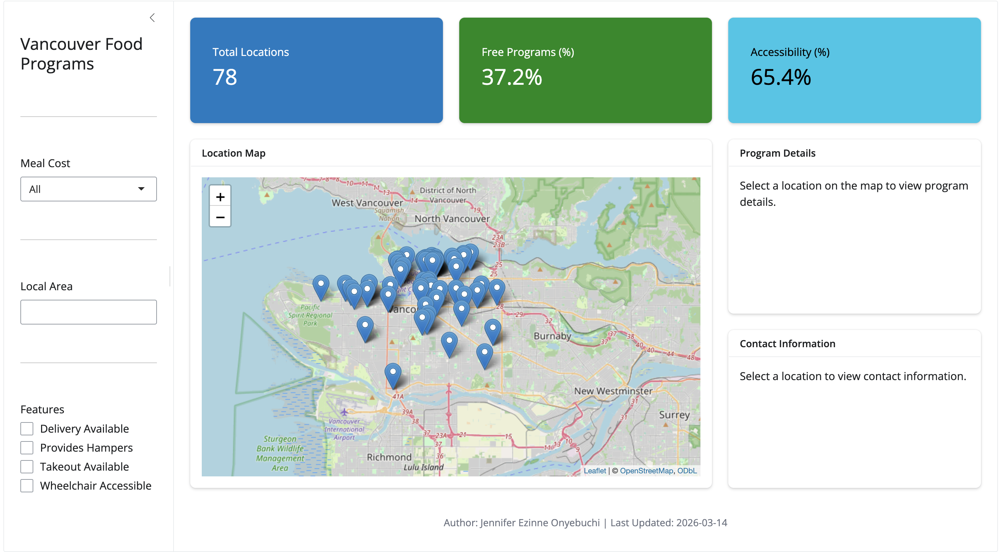

[← Back to Projects](projects.qmd)

---

## Overview

A dashboard helping Vancouver residents experiencing food insecurity find free or low-cost food supports — including meal programs and food hampers — in their area.

{fig-alt="Vancouver Food Finder dashboard" width="100%"}

---

## The Problem

Many food support programs exist across Vancouver, but information about them is scattered and difficult to search or compare. People in need often can't easily find what's available near them, what it costs, or what access requirements exist.

---

## What I Built

- An interactive map-based dashboard using Kepler.gl and ipyleaflet to show program locations across Vancouver
- Filters by service type, cost, and access requirements
- Built with the City of Vancouver Food Programs open dataset which includes both program details and geospatial information

---

## Tools & Technologies

| Category | Tools |
|---|---|
| Language | Python |
| Dashboard | Shiny · shinylive · shinywidgets |
| Visualisation | Plotly · Altair · plotnine |
| Mapping | Kepler.gl · ipyleaflet |
| Data | Pandas · Polars · DuckDB · Ibis · PyArrow · Narwhals |

---

## Links

[View Live Dashboard](https://019cef23-c652-2511-545b-2cb41c20e20d.share.connect.posit.cloud/){.btn .btn-primary .rounded-pill .me-2}
[View GitHub Repo](https://github.com/UBC-MDS/DSCI-532_2026_22_Vancouver-LC_Food-Programs){.btn .btn-outline-primary .rounded-pill}
